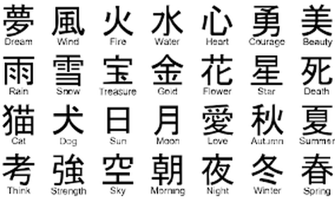

The Japanese culture is one that struck my interest for a long time. It lasted for many years since middle school, from reading traditional history and folklore to watching and listening to different medias of pop-culture. In my opinion, however, I felt the experience can be the greatest if I learned one thing: the language.

Since December 2019, I found the will to push myself towards the endeavor of learning the Japanese language, which is considered one of the toughest languages to learn due to its reading and writing styles. This will was driven with the desire to not only submerse myself with the culture, but also further prove my academic worth for learning such a difficult language. Since making this goal, I have obtained study materials, such as textbooks and podcasts, to learn from.

I planned on taking the JLPT (Japanese Learning Proficiency Test) for the first time in Dececmber 2020 to examine my progress with the language. The level of proficiency measured by the exam comes in 5 steps from less to most proficient: N5, N4, N3, N2, and N1. For a beginner's goal, I hope to achieve N4 proficiency. 

Source: NA

Status: Ongoing
