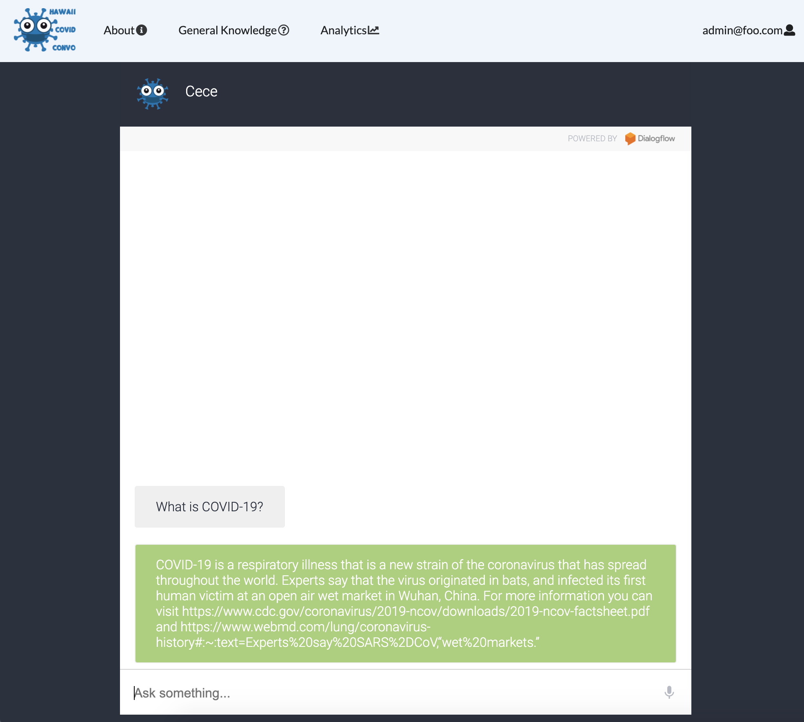
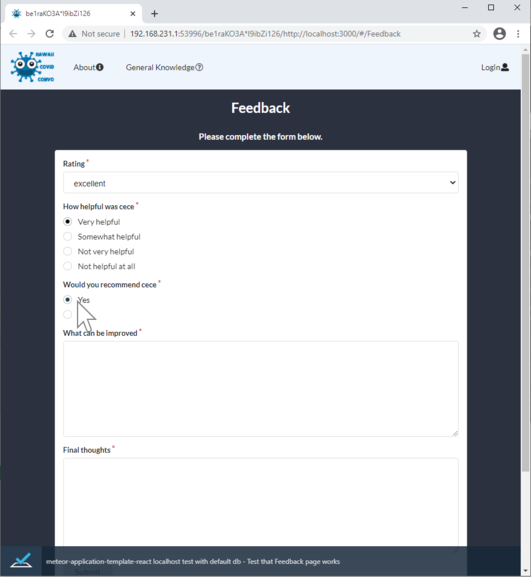

# Project Overview

Hawaii Covid Convo is a web application that features a chatbot named "Cece" who can answer questions regarding COVID-19 while providing navigation to other informational sites. The web application utilizes both the database program "MongoDB" and Google's Cloud Service, [Dialogflow](https://cloud.google.com/dialogflow/docs) for data management and chatbot functionality. The overall design was implemented using Semantic UI React under the Meteor web framework.

## Contributions

### Implementing TestCafe Availability Tests
One of my major contributions for the final project was implementing availability tests using Node.js's automation tool, "TestCafe". With TestCafe, I was able to test our web application to see whether all pages in the application are displayed for both anonymous and login users. Furthermore, I was able to test whether all survey forms are operational with legal inputs. The code involving all the test processes are located under the tests folder in the app directory of our project.

### Improving Quality of Pages and Components
Another contribution I made for the final project was implementing additional details to the About page and the Footer. In the about page, I included profile cards for each group member of HI-Covid-Convo's development team. Each card contains a member's profile picture, biography, interests, and GitHub link. In the web application's footer, I added links for each page accessible to any user. One of the links directs a user to the Resources page which was not listed in the header bar.

## Outcomes and Experience

Our final project incorporates all the teachings we learned throughout the Fall 2020 semester of ICS314, such as building visually appealing pages and managing data through a database. Despite complications in the first phase of the project regarding planning and design, we were able to incorporate all the features our application intended to have. We managed our time very wisely and had each member contribute to the best of their ability. Compared to all the other group projects in my entire school life, this project proved to be the best project I had participated. 

Status: COMPLETED

Developer's page: [Click Here](https://hi-covid-convo.github.io)

Web application's source code: [Click Here](https://github.com/hi-covid-convo/hi-covid-convo)

