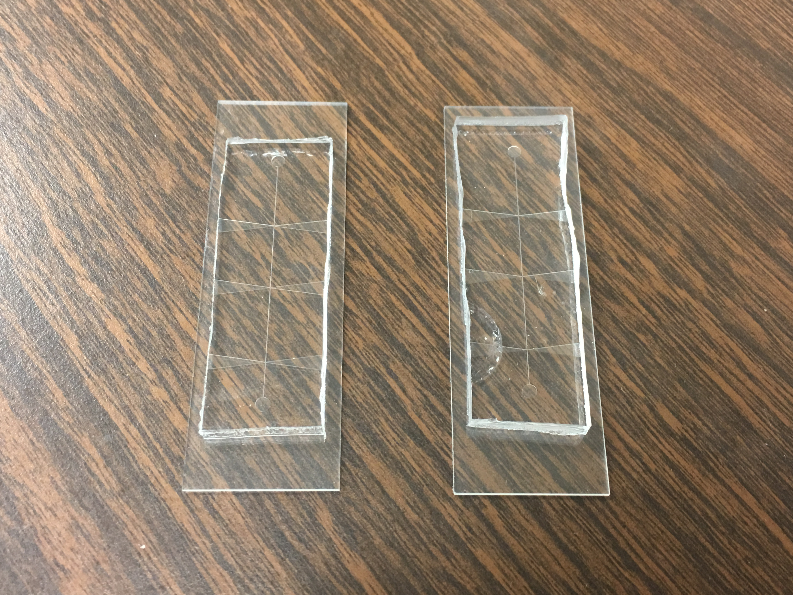
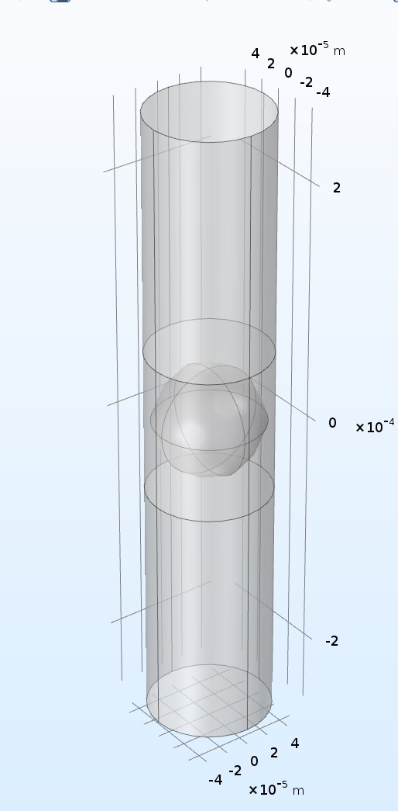

  Cell impedance analysis is a powerful tool in biomedical research that can be used to track the growth and development of cells based off of measurement changes in impedance. Such research, for example, includes tracking the change of impedance from of white blood cells CD4+ T-lymphocyte to determine the likelihood of someone infected with the uncurable disease HIV. However, the technology used to measure the impedance is expensive, which poses a challenge to researchers in third-world countries.

  In this project, we researched experimental data of the polystyrene bead and the cell medium's dimensions, conductivity, and permitivity to derive values for the resistance and capacitance of a cell model given by Maxwell's mixture theory. These values were then modeled through two programs, Matlab and COMSOL, to determine a theoretical value of the cell's impedance. 3-day lab sessions were held on multiple occasions to create microfluidic devices for the bead and medium to flow into. After creating enough devices, we utilized two impedance analyzers, the IM3570 (expensive) and AD5933 (cheap), to experimentally determine the impedance of the cell. These value were then compared with the theoretical impedance and amongst each other to measure any inconsistencies in accuracy.

Status: COMPLETED
