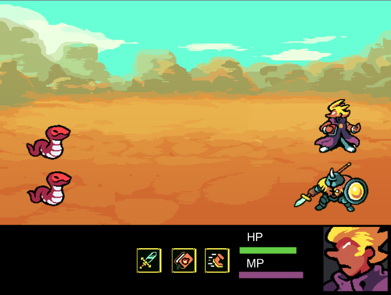

Unity is a third-party game engine developed by Unity Technologies, well known across the gaming community alongside other software.
It allows game developers to create a variety of games ranging from 2D/3D games to simulations and can support development across multiple platforms,
such as PC, console, and mobile.

Source: NA
Status: Ongoing
